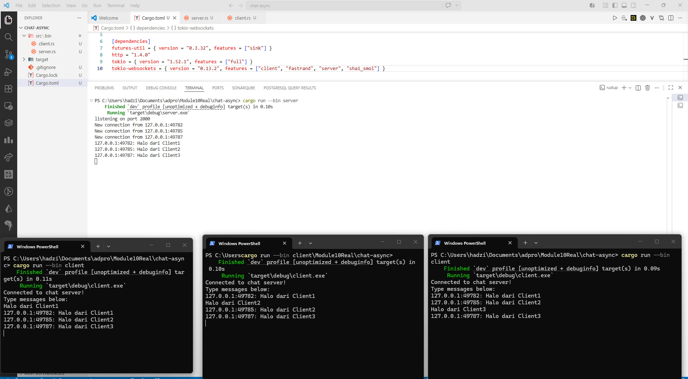
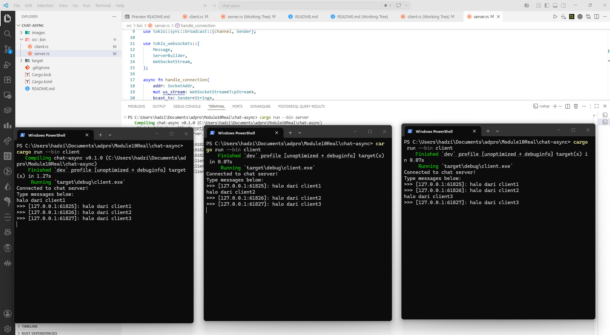

# Chat Async - Broadcast Chat dengan Pemrograman Asinkron

## Refleksi Experiment 2.1: Original code, and how it run

Pada eksperimen ini, saya menjalankan aplikasi broadcast chat yang menggunakan pemrograman asinkron dengan menjalankan satu unit server dan tiga unit client secara bersamaan.

Untuk memulai aplikasi, saya menjalankan perintah `cargo run --bin server` pada satu terminal untuk membuka listener pada port 2000, kemudian menjalankan `cargo run --bin client` di tiga terminal lainnya untuk menghubungkan mereka ke server.

Ketika sebuah pesan diketik pada salah satu client, pesan tersebut dikirimkan ke server melalui protokol websocket secara asinkron tanpa memblokir input dari pengguna lain.

Server kemudian menerima pesan tersebut dan menyiarkannya (broadcast) kembali ke seluruh client yang terhubung sehingga semua pengguna dapat melihat pesan yang dikirimkan.

Hal ini menunjukkan efisiensi pemrograman asinkron dalam menangani banyak koneksi I/O-bound sekaligus hanya dengan menggunakan sumber daya CPU yang minimal dibandingkan jika menggunakan OS threads tradisional.

Melalui percobaan ini, terlihat bahwa server mampu mengelola status banyak koneksi secara konkuren, memproses pesan masuk, dan mendistribusikannya secara real-time.

Penggunaan protokol websocket di sini sangat krusial karena memungkinkan komunikasi dua arah yang persisten dan lebih efisien daripada siklus request-response HTTP biasa.

## Refleksi Experiment 2.2: Modifying port

Dalam eksperimen ini, saya berhasil mengubah port komunikasi websocket dari port default 2000 menjadi port 8080 untuk meningkatkan pemahaman mengenai konfigurasi jaringan pada aplikasi asinkron.

Modifikasi ini harus dilakukan pada dua sisi utama, yaitu pada file `src/bin/server.rs` di bagian `TcpListener::bind` dan pada file `src/bin/client.rs` di bagian pendefinisian URI websocket.

Perubahan pada kedua sisi sangat krusial karena websocket merupakan protokol berbasis koneksi; jika port pada sisi listener (server) dan connector (client) tidak sama, maka jabat tangan (handshake) awal akan gagal dan koneksi tidak dapat terjalin.

Meskipun port diubah, aplikasi ini tetap menggunakan protokol websocket (`ws://`) yang sama, yang menyediakan saluran komunikasi dua arah yang persisten di atas koneksi TCP tunggal.

Definisi protokol ini secara teknis diatur melalui crate `tokio_websockets` yang digunakan dalam kode, di mana crate tersebut menangani proses enkapsulasi pesan ke dalam frame websocket agar dapat dibaca oleh kedua belah pihak.

Selain file server dan client utama, tidak ada file konfigurasi lain yang perlu diubah karena alamat IP dan port didefinisikan secara langsung (hardcoded) di dalam kode sumber tersebut.

Setelah menjalankan kembali sistem dengan port 8080, saya memverifikasi bahwa fungsionalitas broadcast tetap berjalan sempurna, di mana pesan dari satu client tetap dapat diterima oleh server dan disiarkan ke seluruh client lainnya secara asinkron.

## Experiment 2.3: Small changes, add IP and Port

1. Pada eksperimen ini, saya memodifikasi logika server agar setiap pesan yang disiarkan ke seluruh client menyertakan identitas unik berupa alamat IP dan nomor port pengirim.
2. Informasi alamat ini diperoleh dari variabel `addr` bertipe `SocketAddr` yang ditangkap oleh server saat proses jabat tangan TCP pertama kali terjadi.
3. Modifikasi dilakukan dengan menggunakan makro `format!` di sisi server untuk menggabungkan alamat pengirim dengan isi pesan teks sebelum dikirim ke saluran broadcast.
4. Perubahan ini memungkinkan setiap pengguna chat untuk mengidentifikasi asal pesan secara spesifik meskipun aplikasi belum memiliki sistem login atau username.
5. Di sisi client, saya menyesuaikan output terminal agar pesan yang diterima dari server ditampilkan dengan format yang lebih menonjol agar informasi pengirim mudah dibaca.
6. Hal ini menunjukkan bagaimana metadata koneksi dalam pemrograman asinkron dapat dimanfaatkan untuk memperkaya data aplikasi tanpa memerlukan input tambahan dari pengguna.
7. Dengan menyertakan port, kita bisa membedakan antar client meskipun mereka berasal dari IP lokal yang sama (127.0.0.1), karena setiap koneksi websocket akan membuka port ephemeral yang berbeda di sisi client.
